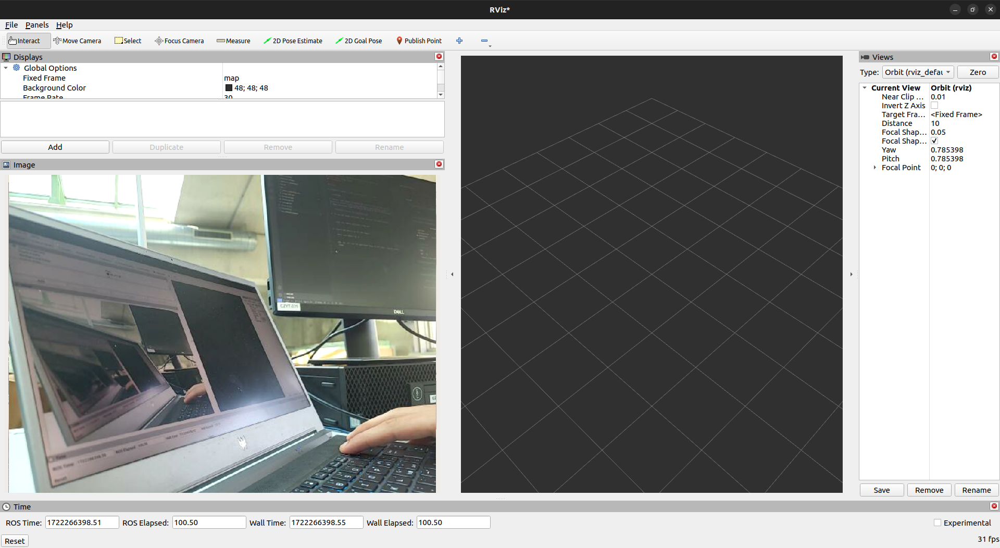

# Phone Camera ROS2 Package

This ROS2 package allows you to utilize the camera of your phone and publish the captured images on the `/phone_camera/image` topic. To use this package, you will need to install DroidCam on both your phone and your Linux machine.

## Installation

1. Install DroidCam on your phone from the Google Play Store or App Store.
2. Install DroidCam on your Linux machine by following the instructions provided on the [DroidCam website](https://www.dev47apps.com/droidcam/linux/).
3. Clone this repository into the `src` directory of your ROS workspace:
    ```
    git clone https://github.com/yassinfrh/phone_camera_ros2
    ```
4. Build the ROS2 package
    ```
    colcon build
    ```
5. Source the workspace
   ```
    source install/setup.bash
    ```
## Usage

1. Launch DroidCam on your Linux machine
   ```
    droidcam
    ```
2. Connect your phone following the instructions provided on the [DroidCam website](https://www.dev47apps.com/droidcam/connect/).
3. Once connected, read the device ID shown in the DroidCam window

    

4. To run the image publisher node, use the following command:

    ```
    ros2 run camera_publisher image_pub
    ```

5. Insert the device ID for the camera
   ```
    Enter the camera ID: 0
    ```

    Now you can find the published image on the topic `/phone_camera/image`.

    

## Future Implementations

In future updates, we plan to add the following features to the `phone_camera_ros2` package:

1. Camera Calibration: Implement a camera calibration module that allows users to calibrate the camera and obtain intrinsic and extrinsic camera parameters.

2. Camera Info Publishing: Publish the camera information (intrinsic and extrinsic parameters) on a separate topic, such as `/phone_camera/camera_info`, to provide additional metadata about the captured images.

Stay tuned for these exciting updates!
