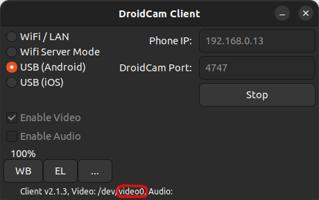

# Phone Camera ROS2 Package

This ROS2 package allows you to utilize the camera of your phone and publish the captured images on the `/phone_camera/image` and the camera info on the `/phone_camera/camera_info` topics. To use this package, you will need to install DroidCam on both your phone and your Linux machine.

## Installation

1. Install DroidCam on your phone from the Google Play Store or App Store.
2. Install DroidCam on your Linux machine by following the instructions provided on the [DroidCam website](https://www.dev47apps.com/droidcam/linux/).
3. Clone this repository into the `src` directory of your ROS workspace:
    ```
    git clone https://github.com/yassinfrh/phone_camera_ros2
    ```
4. Build the ROS2 package
    ```
    colcon build
    ```
5. Source the workspace
   ```
    source install/setup.bash
    ```
## Usage

1. Launch DroidCam on your Linux machine
   ```
    droidcam
    ```
2. Connect your phone following the instructions provided on the [DroidCam website](https://www.dev47apps.com/droidcam/connect/).
3. Once connected, read the device ID shown in the DroidCam window

    

4. To run the image publisher node, use the following command:

    ```
    ros2 run camera_publisher image_pub
    ```

5. Insert the device ID for the camera
   ```
    Enter the camera ID: 0
    ```

    Now you can find the published image on the topic `/phone_camera/image` and the camera info on the topic `/phone_camera/camera_info`.

    


## Camera calibration

In order to have the camera info published on the topic `/phone_camera/camera_info`, you need to perform the camera calibration first. The calibration can be performed by running the `camera_calibration` node in the `camera_publisher` package. Follow these steps to perform the calibration:

1. Run the `camera_calibration` node:
    ```
    ros2 run camera_publisher camera_calibration
    ```
2. Specify the device ID of the camera and the size of the checkerboard used for the calibration. For example:
    ```
    Enter the camera ID: 0
    Enter the number of rows in the checkerboard: 7
    Enter the number of columns in the checkerboard: 10
    ```
3. A window will pop up displaying the image from the camera. If a checkerboard is detected, the corners of the checkerboard will be shown on the image.
   

4. Left-click on the image to save the calibration points. You need to save at least 10 sets of points.
   
5. Right-click on the image to start the calibration process. The calibration parameters will be saved in a file in the `share` folder of the package.

Once the calibration is complete, the camera info will be published on the topic `/phone_camera/camera_info`.